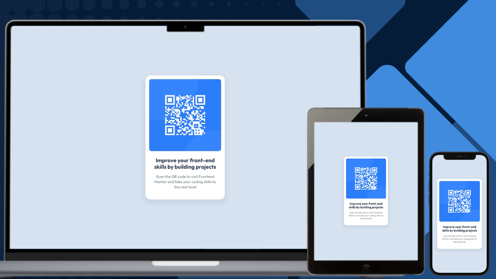

# Frontend Mentor - QR Code Component Solution

## Links

- [Solution URL on GitHub](https://github.com/TetianaAleks/fm-solutions-hub/tree/main/01-qr-code-component-main)
- [Live Site on GitHub Pages](https://tetianaaleks.github.io/fm-solutions-hub/01-qr-code-component-main/)
- [Solution on Frontend Mentor](https://www.frontendmentor.io/solutions/responsive-qr-code-component-using-html-css-and-flexbox-7O_PI0fTOw) 

## Built with

### Frontend

- HTML
- CSS
