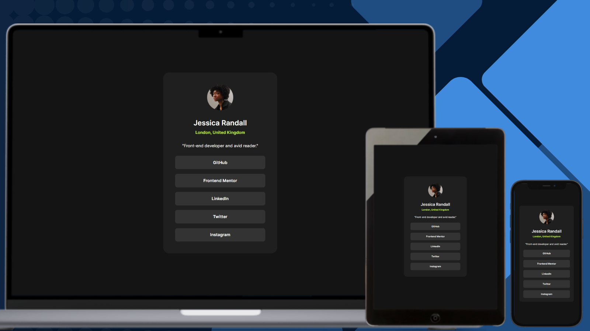

# Frontend Mentor - Social Links Profile Solution

## Links

- [Solution URL on GitHub](https://github.com/TetianaAleks/fm-solutions-hub/tree/main/03-social-links-profile)
- [Live Site on GitHub Pages](https://tetianaaleks.github.io/fm-solutions-hub/03-social-links-profile/)
- [Solution on Frontend Mentor](https://www.frontendmentor.io/solutions/responsive-social-links-card-with-semantic-html-rem-units-and-css-varia-Cwauw2jcPG) 

## Built with

### Frontend

- HTML
- CSS
