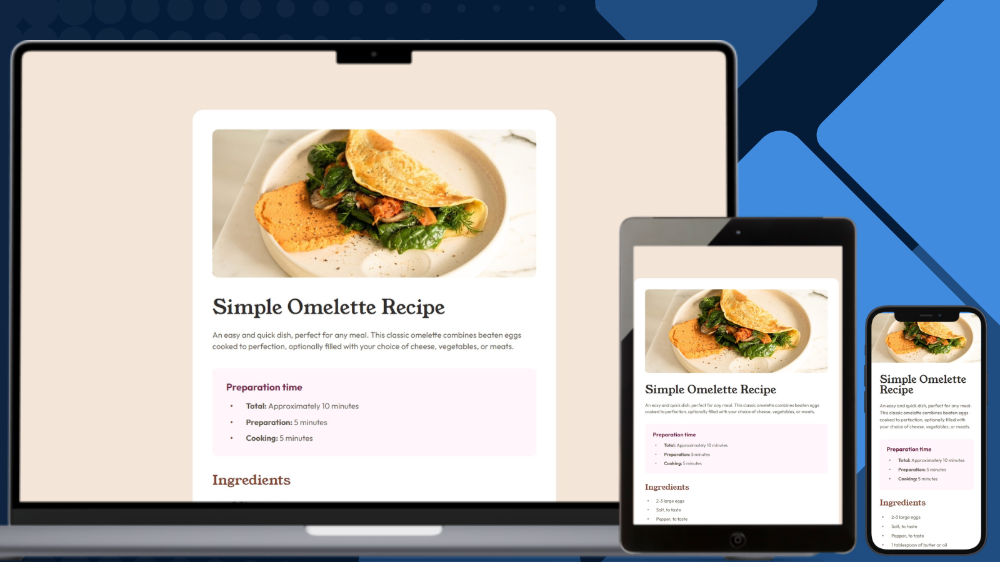

# Frontend Mentor - Recipe Page Solution

## Links

- [Solution URL on GitHub]()
- [Live Site on GitHub Pages]()
- [Solution on Frontend Mentor](https://www.frontendmentor.io/solutions/recipe-page-semantic-html-css-custom-properties-and-accessible-tables-xk02taac2w) 

## Built with

### Frontend

- HTML
- CSS
