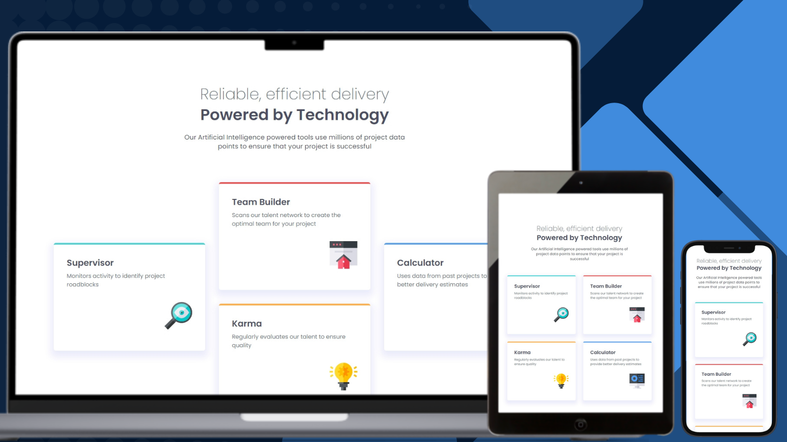

# Frontend Mentor - Four Card Feature Section Solution

## Links

- [Solution URL on GitHub](https://github.com/TetianaAleks/fm-solutions-hub/tree/main/06-four-card-feature-section)
- [Live Site on GitHub Pages](https://tetianaaleks.github.io/fm-solutions-hub/06-four-card-feature-section/)
- [Solution on Frontend Mentor](https://www.frontendmentor.io/solutions/solution-title-include-some-of-the-tools-and-techniques-you-used-to-c-nUF_1kH0gr) 

## Built with

### Frontend

- HTML
- CSS
