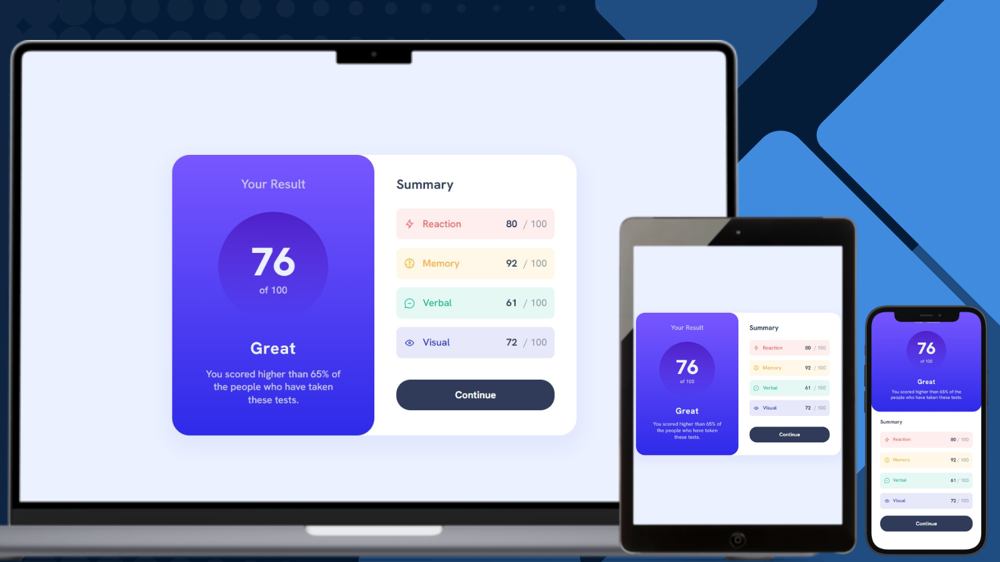

# Frontend Mentor - Results Summary Component Solution

## Links

- [Solution URL on GitHub](https://github.com/TetianaAleks/fm-solutions-hub/tree/main/09-results-summary-component)
- [Live Site on GitHub Pages](https://tetianaaleks.github.io/fm-solutions-hub/09-results-summary-component/)
- [Solution on Frontend Mentor](https://www.frontendmentor.io/solutions/results-summary-component-mLArmaFhfO) 

## Built with

### Frontend

- HTML
- CSS
- JS