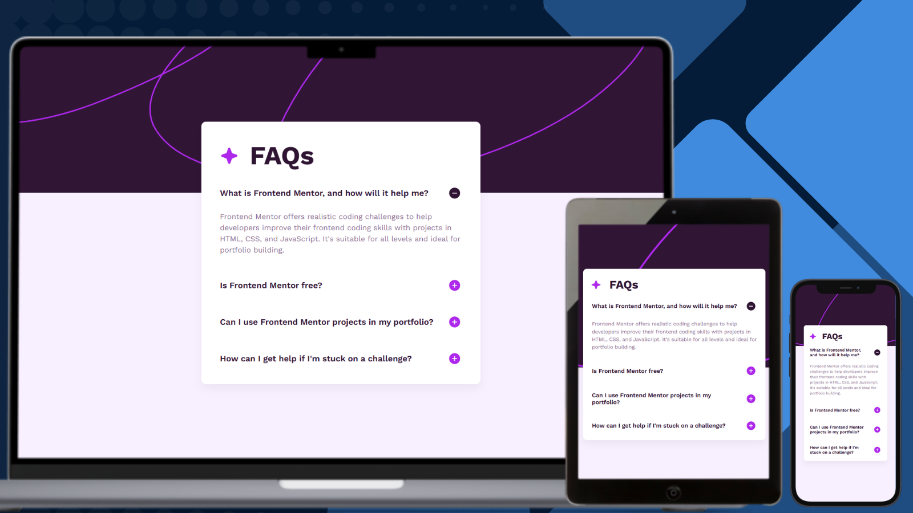

# Frontend Mentor - FAQ Accordion Solution

## Links

- [Solution URL on GitHub](https://github.com/TetianaAleks/fm-solutions-hub/tree/main/26-faq-accordion)
- [Live Site on GitHub Pages](https://tetianaaleks.github.io/fm-solutions-hub/26-faq-accordion/)
- [Solution on Frontend Mentor](https://www.frontendmentor.io/solutions/faq-accordion-5TH4ySRZGR) 

## Built with

### Frontend

- HTML
- CSS
- JS